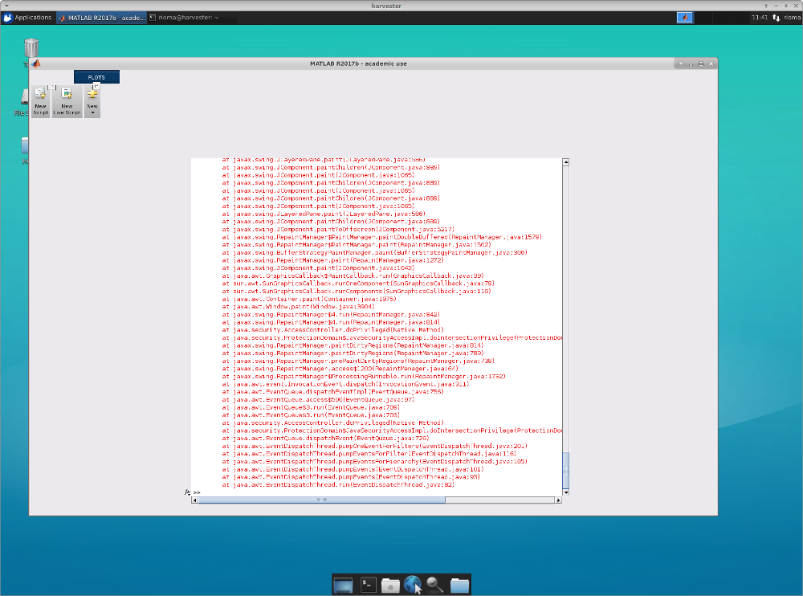

# Notes

This file regroups some maintenance notes about the analysis machine.


## 20180315 - X2go and Matlab

If you use `matlab2017b` with x2go, you may experience some ugly glitches + numerous red error messages about `java` stuff, as soon as you move the window...



This problem is due to the version of java used by matlab 2017b (version 1.8) which as a bug.
You can avoid this annoying behavior by setting an option (disabling some graphics actuallyu) for java in the following ways (pick one :D):

- create a `java.opts` file in your matlab startup folder and put `-Dsun.java2d.xrender=false` in it (this set java option for matlab only (see https://nl.mathworks.com/help/matlab/matlab_env/java-opts-file.html)
- create a `java.opts` file in `/usr/local/MATLAB/R2017b/bin/glnxa64/` and put `-Dsun.java2d.xrender=false` in it (**warning**: you need to be admin for that and it affects all users)
- export an environment variable with this option, typing `export _JAVA_OPTIONS='-Dsun.java2d.xrender=false'` in the terminal before starting matlab (or add it to your at the end of your `.bashrc` so you can forget about it ;-))
- type `_JAVA_OPTIONS='-Dsun.java2d.xrender=false matlab` instead of `matlab` in the terminal, every time want to start matlab (or add an alias in your `.bashrc` and forget about it ;-))

Some references describing the bug:

- https://bugs.x2go.org/cgi-bin/bugreport.cgi?bug=645#15
- https://bugs.x2go.org/cgi-bin/bugreport.cgi?bug=645#20


## 20180905 - Btrfs

When setting up a new analysis machine, the data partition (traditionally `/mnt/data`) is a btrfs-based RAID.

Few remarks about btrfs on Ubuntu 16.04 (root rights needed for the commands):

- be careful, the usual command `mkfs.btrfs -L data /dev/<drive1> /dev/<drive2> ...`(where `<drive1>`, `<drive2>` etc. stands for the full drives used in the RAID pool) make a RAID0 (= no copy of data, space of all drives pulled together) not a redundant RAID1 or RAID10,
- use `mkfs.btrfs -L data -d raid1 /dev/<drive1> /dev/<drive2> ...`to get RAID1 for data at creation time. Use `-m raid1` to get RAID1 for metadata too (seems to be the default actually).
- to check the RAID type an usage, the command `btrfs filesystem usage /mnt/data` gives a nice summary
- to change RAID type (after creation), use balancing operation `btrfs balance start -dconvert=raid1 -mconvert=raid1 /mnt/data` (here to convert data and metadata to RAID1). No need to unmount `/mnt/data` (thanks to the awesomeness of btrfs). It can take quite some time, so running the command in a `tmux` session or in background is in general a good idea.
- btrfs-RAID1 just ensures that data is duplicated (2 copies), which is different from other conventional RAID1 (which keep N copies, N >= 2). Apart from that, it is quite extensible, i.e. more drives can be added to a mounted partition (OK you still need to turn of the computer to add the drive, but you use the machine while the new drive is getting integrated to the RAID array, more awesomeness :-)). One can start using RAID1 with 2 drives.
- On the contrary, RAID10 necessitates at least 4 drives. Depending on the benchmarks, RAID10 can seem faster... check phoronix benchmarks for btrfs RAID configurations, there are updated from time to time. For now I would prefer RAID1, but maybe it's a not optimal call.
- Finally, it seems that `df` command now reports sensible values for the available space on btrfs-RAID partitions (tip: `df -h`to get human readable values).


## 20181126 - Btrfs

To diagnose problems with drives in a btrfs filesystem

- start scrub: `sudo btrfs scrub start <mount point>`and wait a long time (e.g. 7H for 4x4 TB drives)
- check scrub status after: `sudo btrfs scrub status <mount point>` to see the number of unrecoverable errors
- find affected files in `dmesg` messages: `dmesg | grep BTRFS | grep path`
- check drives health with `smartctl` (installed via `sudo apt install smartmontools`):

    - `sudo smartctl -t short <dev path>` or `sudo smartctl -t long <dev path>` to start short or long test, in the  background
    - `sudo smartctl -a <dev path>` or `sudo smartctl -x <dev path>` to get short or long report about drive and test outcomesTo change a drive in a RAID1 array in BTRFS

- if possible, attach the new drive without removing the defective one
- if needed, you can wipe filesystem informations from this new drive using `sudo wipefs -a <dev path of new drive>`
- use `replace`command, `sudo btrfs replace start <ID> <dev new> <mount point>` where `<ID>` is the btrfs number for the device to replace (can be obtained using `sudo btrfs device usage <mount point>` for example)
- **do not** use `btrfs device delete` to remove the problematic drive, as btrfs will try to reduplicate data elsewhere, it will take ages and may not succeed depending on the actual remaining space, and this is not interruptable (well unless you shut down the computer, which is a bad idea in general)
- re-balance data across the RAID volume using `sudo btrfs balance start <mount point>` (use `-dusage` option, to avoid a full balancing that can take a very long time) and use `sudo btrfs balance status <mount point>` to monitor it

Good source of information: https://btrfs.wiki.kernel.org/index.php/Using_Btrfs_with_Multiple_Devices#Using_add_and_delete


## 20181207 - lm-sensors

Changes to chainsaw to report temperature in monitorix (could be useful for other machines):

- install `lm-sensors` and run `sudo sensors-detect` (use default answers) and let it add required modules to `/etc/modules.conf`
- install `extra` package for current kernel, to be sure to have the required module (wasn't the case for 4.13, I had to install `linux-image-extra-4.13.0-45-generic`)
- in `/etc/monitorix/monitorix.conf` turn `lmsens` line (in `graph_enable` section) to `y`
- make sure `lm-sensors` service is running, restart monitorix service (`service lm-sensors restart` and `service monitorix restart`)
- check http://chainsaw.mrsic-flogel.swc.ucl.ac.uk:8080/monitorix to see if new temperature graphs are available


## 20190205 - Create symlinks in Thunar

A not-that-easy to find feature of Thunar (the default file manager on Linux machines with Xubuntu) is how to create symbolic links for a bunch of files in a different folder:

1. open a thunar window in the folder with the files, `<source folder>`
2. open another thunar window in the target folder (where to create the links), `<dest. folder>`
3. select the files of interest in  `<source folder>`, start dragging them (holding left mouse button)
4. press and hold ctrl+shift keys
5. finish dragging to `<dest. folder>`
6. release mouse button, ctrl and shift keys


## 20190613 - Fixed kernel version

Recent kernels (4.4.0-143+) are not playing well with Nvidia driver so I changed the default booted kernel to 4.4.0-142 (known to work with nvidia driver) following https://askubuntu.com/questions/216398/set-older-kernel-as-default-grub-entry

- `sudo cp /etc/default/grub /etc/default/grub.bak`
- set `GRUB_DEFAULT="Advanced options for Ubuntu>Ubuntu, with Linux 4.4.0-142-generic"` in `/etc/default/grub`
- `sudo update-grub`
- reboot the machine


## 20190827 - X2go and Matlab

There can be an issue with X2go and matlab, where matlab stops computations (implying plotting and saving figures) whenever the X2go session is disconnected, but happily continues when user reconnects the session.

It seems that the slowdown affects graphical applications in general when x2go is suspended (CLI tools seem fine).
It is known, see https://bugs.x2go.org/cgi-bin/bugreport.cgi?bug=1342 and https://superuser.com/questions/1415349/running-gui-without-need-of-remote-desktop-connection-on-going.

It can be fixed changing some configuration in `/etc/x2go/x2goagent.options`, replacing `X2GO_NXOPTIONS=""` with `X2GO_NXOPTIONS="sleep=0"`.


## 20190916 - Citrix_receiver

When you install Citrix receiver on Linux (to get access to Desktop@UCL Anywhere), you need to may need to add certificates of root CAs, otherwise it doesn't recognize `https://my.desktop.ucl.ac.uk`as a legitimate server.
How to do this? Just steal Firefox certificates:
```
sudo ln -s /usr/share/ca-certificates/mozilla/* /opt/Citrix/ICAClient/keystore/cacerts/
sudo c_rehash /opt/Citrix/ICAClient/keystore/cacerts/
```
and SSL errors go away.


## 20190925 - Upgrade from 16.04 to 18.04

- check sources in `/etc/apt/sources.list.d` and remove old ones (and associated softwares)
- purge nvidia and cuda (including local cuda repo), remove graphics-drivers ppa
- upgrade using `do-release-upgrade`
- install HWE to get kernel 5.0
- install nvidia-430 from GUI
- install cuda-toolkit-10.0 from local .deb

Remarks:

- x2go is an official packages now, no need for external repository
- no need for graphics-drivers PPA
- use slack .deb package instead of snap (snap version has issues with icon and alt+tab list in xfce)
- python regular virtual environments will break (python 3.5 to 3.6)
- check homemade .deb packages (e.g. using checkinstall), may break too


## 20191030 - How to install the East quadrant printer on Linux (well Ubuntu)

For the East quadrant printer (Kyocera M6026cdn), download the "Linux UPD driver with extended feature support" package from Kyocera's wbesite:

https://www.kyoceradocumentsolutions.co.za/index/service___support/download_center.false.driver.ECOSYSM6026CDN._.EN.html

Then unpack it twice and install the ubuntu package:
```
aunpack KyoceraLinux*.zip
aunpack KyoceraLinuxPackages*.tar.gz
sudo dpkg -i KyoceraLinuxPackages-*/Ubuntu/Global/kyodialog_amd64/kyodialog_6.0-0_amd64.deb
sudo apt -f install  # fix missing dependencies
kyodialog6 --telemetry false  # turn off google analytics
```

For each user, use `Printers` from the xfce menu to add a printer:
- select `Network Printer > Internet Printing Protocol (ipp)`
- enter device URI: `ipp://caxton.swc.ucl.ac.uk:631/printers/swc-L4-E-Quad`
- press forward and leave default parameters.


## 20191108 - CUDA 10.0

When installing cuda using the local debian method, for cuda 10.0, install the metapackage `cuda-toolkit-10.0` instead of the recommended `cuda` metapackage...
otherwise it may complain/refuse to install if your nvidia-driver is too recent (say 430) compared to what it expects... even if it runs perfectly fine with more recent drivers.


## 20191218 - Copy speed benchmark

I made some speed benchmarks, copying a 1GB file from `gluegun` (my machine) to winstor.
The aim was to test different file browsers and command line tools to see if some were faster than others.Numbers are in MBit/s (divide by 8 to get MBytes/s) to be easy to compare with the maximum I should be
able to get, which is ~500MBit/s.

Ubuntu 16.04 or 18.04 (with kernel < 5.0)

- Thunar 50 Mbit/s
- PCManFM 50 Mbit/s
- SpaceFM 50 MBit/s
- cp 440 MBit/s
- Nautilus 60 MBit/s
- PCManFM-qt 60 MBit/s
- (g)rsync 440 MBit/s
- ranger 100 MBit/s
- gvfs-copy 50 MBit/s
- Xfe 150 MBit/s
- gnome-commander 170 MBit/sUbuntu 18.04 with kernel 5.0
- gio copy 650 MBit/s
- Thunar 650 MBit/s
- Thunar via `smb://` 250 MBit/s
- gio copy via `smb://` 260 MBit/s

Command line is always pretty fast (results not reported for xubuntu 18.04 with kernel 5.0 but it was the case), but most interestingly Thunar (the default file browser on xubuntu) is much much faster with 18.04 and recent kernel.

There is a nasty glitch in Thunar (and all gnome related file browser) that make it hangs forever if you copy a tiny file (<1KB I think, but not empty) from Winstor (https://bugs.debian.org/cgi-bin/bugreport.cgi?bug=886049).

It's fixed but not (yet) available on Ubuntu 18.04... I am testing this from times to times, so I'll let you know if eventually it's corrected.
Meanwhile, you'll have to do a bit of `cp` or `rsync` just for these ones.


## 20200406 - CUDA 10.1

When using tensorflow 2.1, one needs to install cuda-10.1. Following instructions from https://www.tensorflow.org/install/gpu works fine except

- to avoid removing older cuda versions, install `cuda-toolkit-10-1` instead of `cuda-10-1`
- if you get cublas related errors (crashed the whole python kernel in my case) when executing your code, downgrade it `sudo apt install libcublas10=10.2.1.243-1 libcublas-dev=10.2.1.243-1` (https://github.com/tensorflow/tensorflow/issues/9489#issuecomment-562394257)
